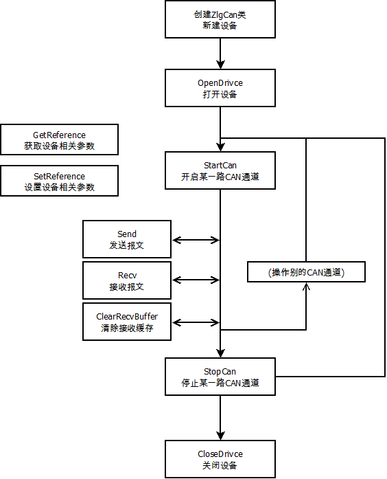

# **ZLGCanControl**

---
---
     
看了下周立功CAN卡的二次开发资料,还是很详细的.     
然而,鉴于Python的可爱,我选择Python.     
我在网上看了类似的库，也看了周立功官网也提供了python二次开发的demo,要么只是个示例,要么包装了奇奇怪怪的东西进去,用起来就是有点不太顺心.     
我有强迫症,看不顺眼的就得重新整.于是呢,就有现在这个了.     
此模块用python对周立功提供的dll文件进行包装,尽可能的以更友好的方式(对,就是更友好的方式,请允许我自恋一下),实现利用Python控制周立功CAN卡的功能。     
* 支持周立功的大部分CAN卡.
* 工程已带周立功提供的库文件,模块自动识别64bit和32bit的Windows系统.
* 模块引用的全部是标准库,无需任何python第三方库,方便使用.
* Python环境要求: Python3.7+


<BR>
<BR>
<BR>

---
## 1. **文件结构介绍**
* **ControlCAN.py文件**
    >   模块核心文件,通过此文件实现模块功能.
* **ControlCANx64文件夹**  
    >   ZLG提供的64bit库文件.若当前使用系统非64bit,此文件夹可删除.
* **ControlCANx86文件夹**  
    >   ZLG提供的32bit库文件.若当前使用系统非32bit,此文件夹可删除.
* **doc文件夹**            
    >   相关文档.
* **demo文件夹**         
    >   使用示例.
* **README.md文件**        
    >   本说明文件.

<BR>
<BR>
<BR>

---
## 2. **操作使用流程**
### 2.1 **操作流程**

      

### 2.2 **操作说明**
* 操作流程,参考了原有周立功DLL库的风格,在其基础上,简化操作,已达到更友好的目的.
    1. 首先,是实例化ZlgCan类,获得一个操作can卡的接口.     
        >在此,只需要告诉python,您的CAN在电脑的那个位置即可.
    1. 第二步,OpenDrivce,这步是python尝试连接can卡硬件.     
        >若成功连接CAN卡,则此can卡被python占用,别的APP则无权在操作CAN卡.    
    1. 第三步,StartCan,这步是开启CAN卡某一个通道.    
        >在此,需要告诉python,被开启的can卡的关键参数,例如:通讯速率,接收过滤.
        >开启此通道后,才能够对此通道CAN进行操作.
    1. 第四步,操作CAN.
        >在此,可以对已经Start的CAN总线,进行收发报文等操作了.
        >这期间,若想操作其他CAN,可以回去调用StartCan开启另外一路CAN通道,然后进行其他操作.
    1. 第五步,StopCAN.关闭CAN卡的某一个通道.对应第三步.
    1. 第六步,CloseDevice.释放CAN卡.对应第二步.
        >习惯性的,在CloseDevice之前,请先StopCan所有已经开启的CAN通道.
* SetReference 和 GetReference
    >一些复杂操作的隐晦的不常用的通用的操作,均通过此函数来实现.      
    >例如,硬件级别的自动发送.此操作在python下,用软件也是轻而易举的.      
    >例如,某些CAN的网络参数.      
    
### 2.3 **示例**
#### 2.3.1 **模块导入**
* 由于未安装到系统路径,故需要明确告诉python环境ControlCAN的位置.对使用者来说,能用得上的,只有VCI,CanObj,ZlgCan这三个类,引入这三个类即可.代码参考如下:     
    ```python
    import sys
    sys.path.append(r'..')  #ControlCAN库所在目录
    from ControlCAN import VCI,CanObj,ZlgCan
    ```
#### 2.3.2 **HelloWorld**
* 哦喔.
    ```python
    print ('---start---')
    # 创建接口类
    zlg = ZlgCan(VCI.USBCAN_2E_U, 0)
    # 打开设备
    zlg.OpenDevice()
    # 开启CAN通讯
    zlg.StartCan("500K",Chx=0)
    # 待发送数据填充.
    msgs = (CanObj*3)()
    msgs[0].Load(0x123,(1,2,3,4,5,6,7,8))
    msgs[1].Load(0x123,(1,2,3,4,5,6))
    msgs[2].Load(0x12345678,(1,2,3,4,5,6,7,8),Ext=1)
    # 发送报文 
    zlg.Send(msgs,Chx=0)
    # 关闭CAN通讯
    zlg.StopCan(Chx=0)
    # 关闭设备 
    zlg.CloseDevice()
    print ('---end---')
    ```
#### 2.3.3 **多个CAN通道同时操作**
#### 2.3.4 **独立线程接收报文**
#### 2.3.5 **报文接收过滤设置**
#### 2.3.6 **日志设置**
### 2.4 **常见错误**

<BR>
<BR>
<BR>

---
## 3 **类介绍**

* 对使用来说,能用得上的类,只有三个:VCI,CanObj,ZlgCan.
* 其他未提及的类及方法变量,若非是研究模块的实现,无需关注.

### 3.1 **VCI**
#### 3.1.1 **说明**
* 此类为周立功DLL支持的设备列表的枚举变量.每个接口卡对应一个枚举变量,变量值为DLL里的驱动编号.
* 直接引用,不可实例化.

<BR>

### 3.2 **CanObj**
####  3.2.1 **说明**
* 收发CAN报文时,用来装载数据的结构体.
* 此类,继承Structure类.对应ZLG的DLL里 VCI_CAN_OBJ 结构体.
#### 3.2.2 **变量**
*   **ID**
```python
        # 报文ID    
```
*   **TimeStamp**
```python
        # 报文时间戳,即设备接收到报文的时间标识.
```
*   **TimeFlag**  
```python
        # 时间戳有效性
        # 值说明:  1=有效  0=无效    
```
*   **SendType** 
```python
        # 报文发送类型.
        # 值说明: 0=正常发送  1=单次发送  2=自发自收  4=单次自发自收
        # 在此模块中,此变量,无意义.
```
*   **RemoteFlag**         
```python
        # 是否为远程帧.
        # 值说明: 0=数据帧  1=远程帧
```
*   **ExternFlag**         
```python
        # 是否为扩展帧.
        # 值说明: 0=标准帧  1=扩展帧
```
*   **DataLen**            
```python
        # 数据长度DLC.
        # CAN规定DLC不能超过8;CANFD中不能超过64.
```
*   **Data**               
```python
        # 数据.
        # 数据长度,CAN规定不能超过8;CANFD中不能超过64.
        # 实际操作过程中,若数据长度超过DLC限定,则自动被忽略.
```
*   **Reserved**           
```python
        # 保留位.
```
#### 3.2.3 **方法**
*  **Load (self,ID,Data,Ext=None,Remote=None):**
```python
    # 用途:
    #   装载数据.
    # 参数说明:     
    #   ID      <-- 报文ID.     
    #   Data    <-- 报文ID.     
    #   Ext     <-- 是否为扩展帧 True=扩展帧  False=标准帧     
    #   Remote  <-- 是否为远程帧 True=远程帧  False=数据帧     
    # 其他说明:
    #   DLC位,会根据Data的长度自动填充,若DLC大于8则DLC限定为8.
```

<BR> 

### 3.3 **ZlgCan**

#### 3.3.1 **说明**
* 周立功CAN卡设备类.
* 对CAN卡的所有操作均需要通过此类的方法来实现.
* 一个设备,对应一个类实例.

#### 3.3.2 **变量**
*   无

#### 3.3.3 **方法**
* **__init__(self, DeviceType, Index=None,Net=None,loggerName=None):**
```python
    # 类初始化.
    # 实例化一个此对象的实例时,即关联上一个ZLG硬件,在实例化时,需要参数中告知ZlgCan关联硬件是啥,以及硬件在电脑中的位置.
    # 参数说明:     
    #   DeviceType     <-- 设备类型号.此参数传入VCI的枚举.
    #   Index          <-- 设备索引号,即ZLG硬件的位置.例如当前只有一个USB2CAN时,索引号为0,这时再插入一个USB2CAN,则新插入的设备索引号为1.
    #                      参数默认为None,此时使用位置0.
    #   Net            <-- 当设备通过网络连接到电脑时,需要使用此参数来告知ZlgCan硬件的位置.
    #                      以下设备必须使用此参数来初始化:xxx(心情好再补充).
    #   loggerName     <-- logger日志名字.用来记录此设备的运行情况.此参数只需传入字符串即可.
    #                      参数默认为None,使用root来记录log.
```

* **OpenDevice (self):**
```python
    # 打开设备.
    # 实例化类后,调用此函数后才能操作设备.
    # 调用此函数即意味着尝试连接设备了,在CloseDevice之前设备将被模块一直占用着.
```

* **CloseDevice (self):**
```python
    # 关闭设备.
    # 调用此函数即意味着断开连接设备了,在OpenDevice之前设备无法操作设备.
```

* **StartCan (self, Chx, BaudRate, Filter=None, mode=None):**
```python
    # 开启某一路CAN通道.
    # 参数说明:     
    #   Chx          <-- 被开启CAN的通道位置.
    #   BaudRate     <-- 被开启CAN的通讯速率.参数类型为字符串.
    #                    目前支持: 5k,10k,20k,50k,100k,125k,250k,500k,800k,1000k.
    #   Filter       <-- 被开启CAN的接收报文过滤设置.可选参数,默认不做任何过滤.当前实现具体功能.
    #   mode         <-- 被开启CAN的模式.可选参数,默认0.  0-正常模式  1-监听模式.
```
* **StopCan (self, Chx):**
```python
    # 停止某一路CAN通道.
    # 参数说明:     
    #   Chx          <-- 被停止CAN的通道位置.
```

* **Send(self, Chx, objs):**
```python
    # 发送报文.
    # 参数说明:     
    #   Chx     <-- 被操作CAN的通道位置.
    #   objs    <-- 待发送的报文.
```

* **Recv(self, Chx, Filter=None, WaitTime=None):**
```python
    # 发送报文.
    # 参数说明:     
    #   Chx      <-- 被操作CAN的通道位置.
    #   Filter   <-- 被开启CAN的接收报文过滤设置.可选参数,默认不做任何过滤.
    #                接收参数类型为返回bool的函数.
    #   WaitTime <-- 接收超时时间.可选参数,默认200ms.
```

* **ClearRecvBuffer (self, Chx):**
```python
    # 清除接收缓冲区.
    # 参数说明:     
    #   Chx      <-- 被操作CAN的通道位置.
```

* **ClearRecvBuffer (self, Chx):**
```python
    # 清除接收缓冲区.
    # 参数说明:     
    #   Chx      <-- 被操作CAN的通道位置.
```
* **GetReference(self, argType):**
```python
    # 获取特殊参数.
    # 参数说明:     
    #   argType <-- 参数类型.
```

* **SetReference(self, argType, \*\*args):**
```python
    # 设置特殊参数.
    # 参数说明:     
    #   argType <-- 参数类型.
    #   args    <-- 待设置的参数.
```

<BR>
<BR>
<BR>


---
## 4 **关于版权**
* 版权就是没有版权.纯粹的学术交流,随便用,不用客气.
* 如果照搬拿走的话,我还望给我刷个存在感.我希望在未来的某一天,我在江湖上行侠仗义的时候,能听到有人在讨论:卧槽,这只<B>北极的企鹅</B>,又在折腾了.

